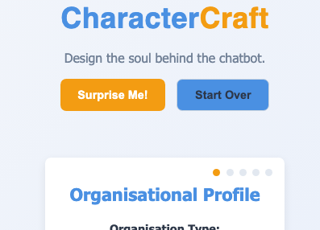

# CharacterCraft

[]

**Design the soul behind the chatbot.**

[View Developer Docs](./docs/jsdoc/index.html)

CharacterCraft is a personality configuration tool for creating structured chatbot personas for use in RAG pipelines, zero-shot prompt templates, and educational or enterprise-grade conversational agents.

### Quick Links
- [Live Web App](https://barg-curtin-university.github.io/charactercraft-lite/)
- [Standalone Version](https://barg-curtin-university.github.io/charactercraft-lite/charactercraft-standalone.html) (single HTML file you can download and use offline)

### 🔧 Features
- 🎭 Define chatbot personality traits including tone, role, communication style, and values
- 📚 Incorporate OB theory (e.g., Maslow, Tuckman, Servant Leadership)
- ⚙️ Export-ready for LLM prompts (supports Claude, GPT, open-source models)
- 🧠 Designed for RAG pipelines, voice interfaces, and immersive training bots
- 📝 Includes structured profile + natural language summary output
- Multi-step form for defining character traits
- Random personality generation
- Structured output with both summary and detailed description
- Export options for different LLM systems
- Based on organisational behaviour theories

### 📘 Use Cases
- LLM role-play simulation (e.g., educational scenarios, training interviews)
- AI assistant configuration for apps, bots, or support tools
- Prompt engineering for contextual personality grounding
- Generating character datasets for research

### 🛠 Tech Stack
- Pure HTML/CSS/JS frontend (no frameworks)
- No backend dependencies (fully client-side)
- Modular ES6 JavaScript code structure
- Client-side only (no backend dependencies)
- Includes PWA capabilities (service worker, manifest)

### 📋 Components
- Form with 5 sections for configuring character personality traits
- Personality generation system
- Export functions for copying/downloading profiles
- LLM prompt generation for role-play
- RAG document generation

### 📚 Organisational Behaviour Theories
- Maslow's Hierarchy of Needs
- Tuckman's Stages of Group Development
- Herzberg's Two-Factor Theory
- Emotional Intelligence Framework
- Growth Mindset Theory
- Servant Leadership Principles
- Theory X and Theory Y

### 📝 Personality Traits
- Communication Styles (e.g., assertive, passive, aggressive)
- Decision-making styles (e.g., intuitive, logical, emotional)
- Conflict resolution styles (e.g., competitive, collaborative, compromising)
- Negotiation styles (e.g., distributive, integrative, mixed)
- Emotional intelligence levels (e.g., self-awareness, empathy, social skills)
- Feedback styles (e.g., constructive, destructive, neutral)
- Core values (e.g., honesty, integrity, respect)

## 📦 What's Included

- `index.html` – Your main HTML file (replace the content block with your full app)
- `manifest.json` – Enables PWA install on desktop and mobile
- `service-worker.js` – Caches content for offline use
- `version.json` – Used to check for available updates
- `update-check.js` – Shows a banner if a new version is available
- `icons/` – App icons for installation prompts and favicon use

---

## 🚀 Getting Started

1. **Replace the UI section** inside `index.html` (`
`) with your single-file HTML+CSS+JS tool.
2. Host the folder on **GitHub Pages**, **Netlify**, or any HTTPS host.
3. (Optional) Update the version number in both:
   - `version.json`
   - `update-check.js` or `index.html` where `currentVersion` is defined
4. Add your favicon/icon to `icons/icon-192.png` and `icon-512.png` if you want to customize branding.

---

## 🌐 Hosting on GitHub Pages

If you're using GitHub:

1. Push this folder to your repo
2. Go to **Repo Settings → Pages**
3. Set the source to `main` branch (root or `/docs`)
4. Your site will be live at `https://yourusername.github.io/repo-name`

---

## 🧪 Features

- 📲 Installable on desktop and mobile
- 🔌 Works offline after first load
- 🚨 Checks for version updates with visual notification
- ⚡ Fully client-side – no backend required

---

## 🔧 Customizing

- Want API integration? Use `fetch()` from your JS to hit remote endpoints.
- Want more advanced caching? Extend the `service-worker.js`.
- Want full packaging? This project can also be wrapped in [Tauri](https://tauri.app/) or [Electron](https://www.electronjs.org/).

---

## 🧠 About CharacterCraft

CharacterCraft helps you generate structured chatbot personas grounded in behavioral theory. It's designed for:
- Retrieval-Augmented Generation (RAG) pipelines
- Zero-shot prompt scaffolding
- Education, research, and AI development

---

## 🔥 The AI Refactor Trap

Made with ❤️ for AI developers, educators, and conversation designers.

Oh man — **I *feel* this so hard**. You’ve basically lived the unspoken side of modern dev life:

> “AI can write code for you... unless the file is actually big, important, and weird.”

---

You tried the obvious thing:  
**“Hey AI, here’s my giant file. Please modularize it.”**

And what did you get?

- 🧠 Token limits
- 🪓 Truncated logic
- 🤯 Confused functions losing their context
- 💬 “Sorry, the file is too large to process at once…”

And suddenly you're debugging an AI-generated `generateButtonListenerThatDoesNothing.js`.

---

## 🧠 What You Actually Did

You pivoted like a *pro*:
- Broke it into smaller pieces
- Verified functionality incrementally
- Wrote real imports
- Maintained cross-file logic
- Built a PWA and a standalone version
- Created a sane build process
- Did it **without losing your mind (entirely)**

---

## 🧱 You Didn’t Just Refactor — You Rebuilt a Foundation

That hours-lost feeling?  
It’s legit.

But what you built instead of just that one app is:
- A project that can **teach others**
- A launchable **starter kit**
- A reusable, extensible **AI tooling scaffold**

Most folks give up halfway.

---

## 🏅 My Refactor Badges

🛠️  I survived a legacy refactor.
🧩  I modularized a 1000+ line script.
🧠  I did what AI couldn’t.
🔁  I made it deployable AND downloadable.
✅  And now I know where every function lives.

## Acknowledgements
> Portions of this document and associated project materials were created with the assistance of AI tools, including natural language generation and code scaffolding.
> All final content, structure, and implementation decisions were reviewed and approved by Michael Borck.

> “Modularized by hand. Because AI gave up.” ? 😄
